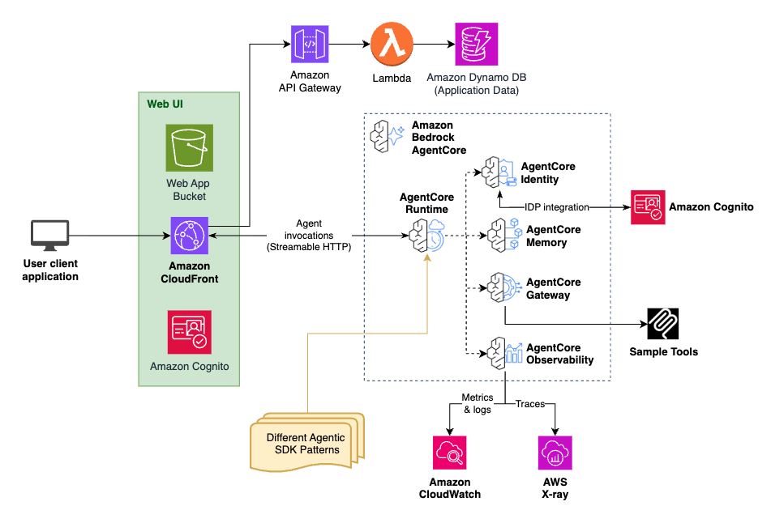

# GenAIID AgentCore Starter Pack (GASP)

The GenAIID AgentCore Starter Pack (GASP) is a starter project repository that enables users (delivery scientists and engineers) to quickly deploy a secured, web-accessible React frontend connected to an AgentCore backend. Its purpose is to accelerate customer engagements from weeks to days by handling the undifferentiated heavy lifting of infrastructure setup and to enable vibe-coding style development on top. 

GASP is designed with security and vibe-codability as primary tenets. Best practices and knowledge from experts are codified in _documentation_ in this repository rather than in _code_. By including this documentation in an AI coding assistant's context, or by instructing the AI coding assistant to leverage best practices and code snippets found in the documentation, delivery scientists and developers can quickly vibe-build AgentCore applications for any use case. AI coding assistants can be used to fully customize the frontend and the cdk infrastructure, enabling scientists to focus the areas where their knowledge is most impactful: the actual prompt engineering and GenAI implementation details. 

With GASP as a starting point and development framework, delivery scientists and engineers will accelerate their development process and deliver production quality AgentCore code following architecture and security best practices without having to learn any frontend or infrastructure (cdk) code.

## Getting Started

If you are a delivery scientist or engineer who wants to use GASP to build a full stack application, follow these steps:

### 1. Set Up Your Development Environment

**Configure Your AI Coding Assistant**

GASP comes pre-configured for popular AI coding assistants:
- **Amazon Q CLI**: Automatically uses `.amazonq/` configuration
- **Cline**: Automatically uses `.clinerules` configuration  
- **Kiro**: Automatically uses `.kiro/` configuration

No additional setup is required - your coding assistant will automatically have access to GASP's development guidelines and best practices.

### 2. Fork and Clone

1. Fork this repository to your own workspace
2. Clone your fork locally
3. Review the [samples repository](https://code.aws.dev/proserve/genaiid/reusable-assets/genaiid-agentcore-starter-pack-samples) for examples that align with your use case

### 3. Deploy Out-of-the-Box

Before customizing, deploy GASP as-is to ensure everything works:
1. Follow the [deployment guide](docs/DEPLOYMENT.md) to deploy the baseline system
2. Verify the frontend loads and authentication works
3. Test the basic chat functionality

### 4. Customize for Your Use Case

Once the baseline is working:
- Modify the agent patterns in `patterns/` for your specific AI logic
- Customize the React frontend in `frontend/src/` as needed
- Update infrastructure in `infra-cdk/` if required
- Refer to development best practices in the `docs/` directory

## GASP Baseline System

GASP comes deployable out-of-the-box with a fully functioning application. This application represents a basic multi-turn chat conversation use case where the backend agent has access to some basic tools. **Do not let this deter you, even if your use case is entirely different! If your application requires AgentCore, customizing GASP to any use case is extremely straightforward through vibe coding.**

### Architecture



The out-of-the-box architecture is shown above. 

### Tech Stack

- **Frontend**: React with TypeScript, Vite build system, Cloudscape Design System
- **Agent Providers**: Multiple agent providers supported (Strands, LangGraph, etc.) running within AgentCore Runtime
- **Authentication**: AWS Cognito User Pool with OAuth support for easy swapping out Cognito
- **Infrastructure**: CDK deployment with S3 static hosting, CloudFront distribution, and AgentCore


## Deployment

The GASP system is deployed using AWS CDK. See the [deployment README](docs/DEPLOYMENT.md) for detailed instructions on how to deploy GASP into an AWS account.

## Project Structure

```
genaiid-agentcore-starter-pack/
├── frontend/                 # React frontend application
│   ├── src/
│   │   ├── components/      # React components
│   │   ├── pages/          # Page components
│   │   ├── common/         # Utilities and constants
│   │   └── styles/         # SCSS styles
│   ├── public/             # Static assets
│   └── package.json
├── infra-cdk/               # CDK infrastructure code
│   ├── lib/                # CDK stack definitions
│   │   └── utils/          # Utility functions
│   ├── bin/                # CDK app entry point
│   ├── config.yaml         # Configuration
│   ├── package.json
│   └── tsconfig.json
├── patterns/               # Agent pattern implementations
│   └── strands-single-agent/ # Basic strands agent pattern
│       ├── basic_agent.py  # Agent implementation
│       ├── requirements.txt # Agent dependencies
│       └── Dockerfile      # Container configuration
├── docs/                   # Documentation
└── README.md
```

## GASP Core Developer Team

|  |  |  |  | |
| -- | -- | -- | -- | -- |
| kaleko@amazon.com | privisaa@amazon.com | razken@amazon.com | zambb@amazon.com | dmonraj@amazon.com | 

## License

This project is licensed under the MIT-0 License.
