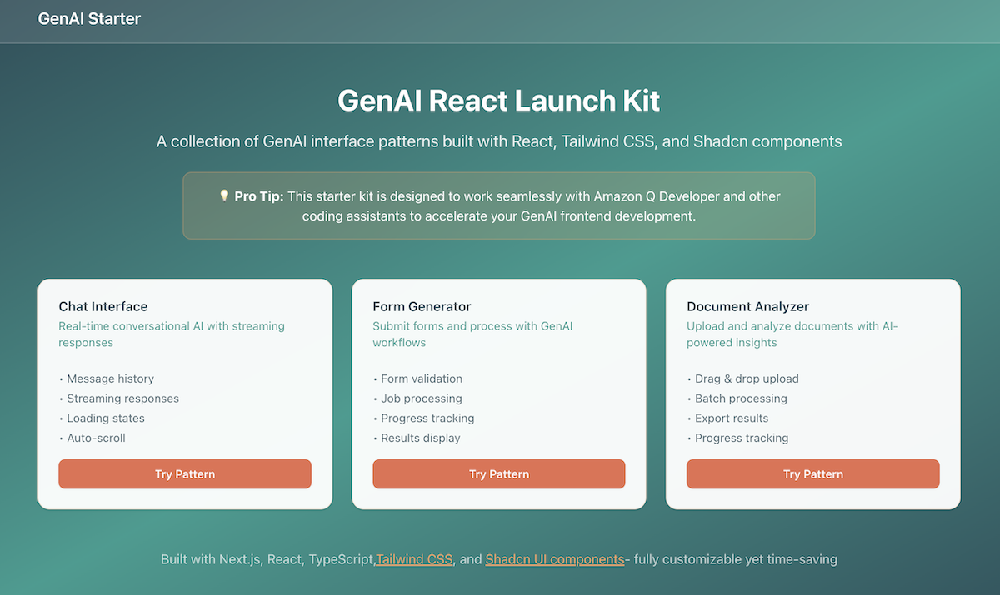
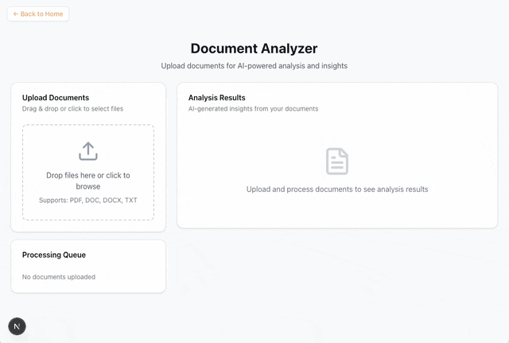
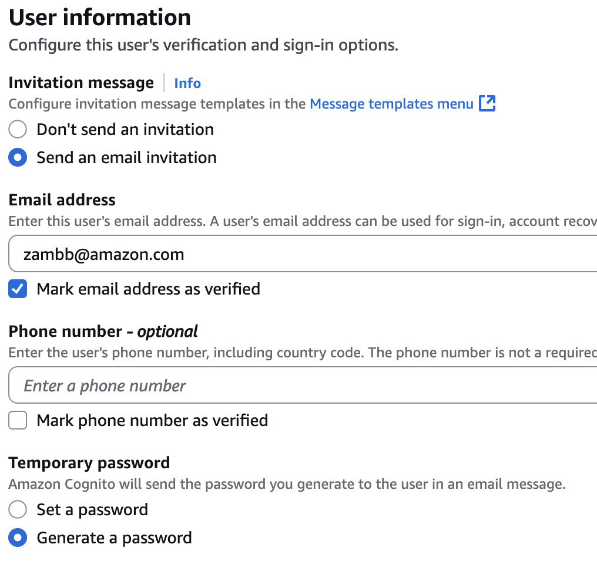

# GenAI React Launch Kit

**The easiest way to build modern GenAI frontends.** Start here for a flexible, production-ready
React application that works with any backend.

**Why start here?** Stop scratching your head about how to setup a modern React application. This
solves the major issues that everyone faces, without locking you in to a particular backend.

What you get:

- A React/Next.js application that's ready to go
- Built-in Cognito authentication support
- Example GenAI interface patterns ready to vibe
- One-command setup scripts for:
  - Cognito
  - Public hosting via AWS Amplify



## What's Included

This project showcases a few GenAI interface patterns as examples of what may be useful, or to serve
as inspiration for what you can create for your own engagements:

- **Chat Interface** - Real-time conversational AI with chat history
- **Form Generator** - Submit forms and process with GenAI workflows
- **Document Analyzer** - Upload and analyze documents with AI-powered insights




## Why This Stack?

Many GenAIIC engagements require some type of UI to truly show the power of what we build. However,
boottrapping a well-designed frontend application is (still) a challenge. This stack aims to solve
that, giving the what you need to start delivering value without added bloat that you don't need.

Also, React Launch Kit is built on popular libraries that are agnostic to styling, while still
giving you a consistent look and feel. Coding agents are very good at working with these
foundational components, so you can take this in any direction that you need.

- **React & Next.js** - Modern React framework
- **Tailwind CSS** - Utility-first styling (infinitely flexible)
- **Shadcn Components** - Pre-built UI components (in `src/components/ui`)

The combination makes it extremely easy to vibe code new components with AI assistants. The only
limitation is your creativity!

## Quickstart

### Prerequisites

- Node.js
- npm

### Installation

Fork this repostory, _or_, clone it and remove the `.git` repository so that you can add it to your
own repo:

```
git clone git@ssh.gitlab.aws.dev:genaiic-reusable-assets/shareable-assets/genai-react-launch-kit.git
cd genai-react-launch-kit
rm -rf .git
```

```bash
# Install dependencies
npm install

# Run the development server
npm run dev
```

That's it! Visit [http://localhost:3000](http://localhost:3000) to see the various patterns. Start
making changes, and your browswer will auto reload. It's that simple to get started.

**NOTE** Authentication is optional during development - the app runs without any auth setup. This
makes local development fast and easy! However, once you deploy it to a public endpoint you'll want
to add authentication with Cognito. Continue reading to learn how to easily do that.

## Deployment

The `bin/` directory includes scripts for fast and easy deployment using AWS Amplify Hosting.
Amplify is simpler than rolling your own CloudFront + S3 bucket.

These steps are all driven by scripts included in the `bin` directory, along with a some manual
configuration.

1. Setup Amplify (one-time)
1. Deploy to Amplify
1. Add cognito auth
   1. Create Cognito User Pool
   1. Configure application
   1. Re-deploy to Amplify

### Step 1: One-time Setup

There is a one-time setup to create your Amplify project. You will need the `APP_ID` and
`DEPLOYMENT_BUCKET` values for the next step.

```bash
# Make sure you're authenticated with your AWS account
./bin/amplify-setup.sh
...
...
-----------------------------------------------------
ℹ Copy these values into the amplify-deploy.sh script:
APP_ID=f12eivw5jgg2kn
DEPLOYMENT_BUCKET=zambb-amplify-builds-5be23b8a
-----------------------------------------------------
```

### Step 2: Deploy

1. Copy the `APP_ID` and `DEPLOYMENT_BUCKET` from above
2. Update these values in the top of `bin/amplify-deploy.sh`

```
--- a/bin/amplify-deploy.sh
+++ b/bin/amplify-deploy.sh
@@ -11,9 +11,9 @@ NC='\033[0m' # No Color
 # Configuration
 #
 # Replace with your actual Amplify Hosting app ID
-APP_ID=YOUR_APP_ID
+APP_ID=f12eivw5jgg2kn
 # Replace with the bucket created from the amplify-setup script
-DEPLOYMENT_BUCKET=USER-amplify-builds-6a5cbe5a
+DEPLOYMENT_BUCKET=zambb-amplify-builds-5be23b8a
```

3. Deploy:

```bash
./bin/amplify-deploy.sh
...
...
ℹ S3 Package: s3://zambb-amplify-builds-5be23b8a/amplify-deploy-1757716942.zip
ℹ Console: https://console.aws.amazon.com/amplify/apps
ℹ App URL: https://main.d12eivw5jgg2kn.amplifyapp.com
```

You'll see some logs during the build stating:

```
Cognito not configured. Proceeding with public view
```

This is ok. You'll add cognito in the next step.

Open up the `App URL`, which will look like `https://main.d12eivw5jgg2kn.amplifyapp.com`, to see
your deployed application.

## Step 3: Add Cognito Authentication

You're not done...your application need authentication!

### Step 1: Create User Pool

Open up the `create-cognito-user-pool.sh` script, and update the `CALLBACK_URL` to the public
amplify URL (`App URL` from above):

```
--- a/bin/create-cognito-user-pool.sh
+++ b/bin/create-cognito-user-pool.sh
@@ -1,7 +1,7 @@
 #!/bin/bash

 # Set this to the Amplify-generated URL, output from the amplify-deploy script.
-CALLBACK_URL=
+CALLBACK_URL=https://main.d12eivw5jgg2kn.amplifyapp.com

 # Validate callback URL is set
 if [ -z "$CALLBACK_URL" ]; then
```

Run the script to create your Cognito User Pool.

```bash
./bin/create-cognito-user-pool.sh
...
...
# Add these to your .env.local file:
NEXT_PUBLIC_COGNITO_REGION=us-west-2
NEXT_PUBLIC_COGNITO_USER_POOL_ID=us-west-2_dOjqX1rTg
NEXT_PUBLIC_COGNITO_CLIENT_ID=6grocs4b70gucr0ircinderbel
NEXT_PUBLIC_COGNITO_REDIRECT_URI=https://main.d12eivw5jgg2kn.amplifyapp.com/
```

### Step 2: Configure Environment

1. Copy the `NEXT_PUBLIC_*` environment variables from the script output
2. Add them to a `.env.local` file (you'll need to create this file)
3. Build and deploy again with `./bin/amplify-deploy.sh`
4. Visit your page, and you should be greeted with a login screen.


### Step 3: Add a User

1. Navigate to the Cognito User Pool in the AWS Console
2. Add a new user for yourself, marking your email as verified
3. Wait a couple of minutes to get an email with your temporary password



That's it! Click the login button to authenticate with Cognito.

## Local development

### Disabling Cognito

Developing locally with `npm run dev` is the best way to operate during development. The app will
reload when you save your changes. If you have setup Cognito and would like to disable during local
development, simply comment out one of the variables in `.env.local`:

```
NEXT_PUBLIC_COGNITO_REGION=us-west-2
# NEXT_PUBLIC_COGNITO_USER_POOL_ID=us-west-2_t2gKC6WfU
NEXT_PUBLIC_COGNITO_CLIENT_ID=7a0vt2mupc83cf8rgd29okrg93
NEXT_PUBLIC_COGNITO_REDIRECT_URI=https://main.d23l1lah9i85ek.amplifyapp.com/
```

The application will notice that one of the varaibles isn't set, and skip the Cognito auth. \*Make
sure to _uncomment_ that before you re-deploy to Amplify

### Testing Cognito locally

If you'd like to run locally _and_ test cognito, change the following variable in `.env.local`

```
NEXT_PUBLIC_COGNITO_REDIRECT_URI=http://localhost:3000
```

## Cognito Troubleshooting

Any issues you run into will likely be from misconfigurations. Feel free to reach out to zambb@ as
he's made all of thos mistakes many times over. :>)
